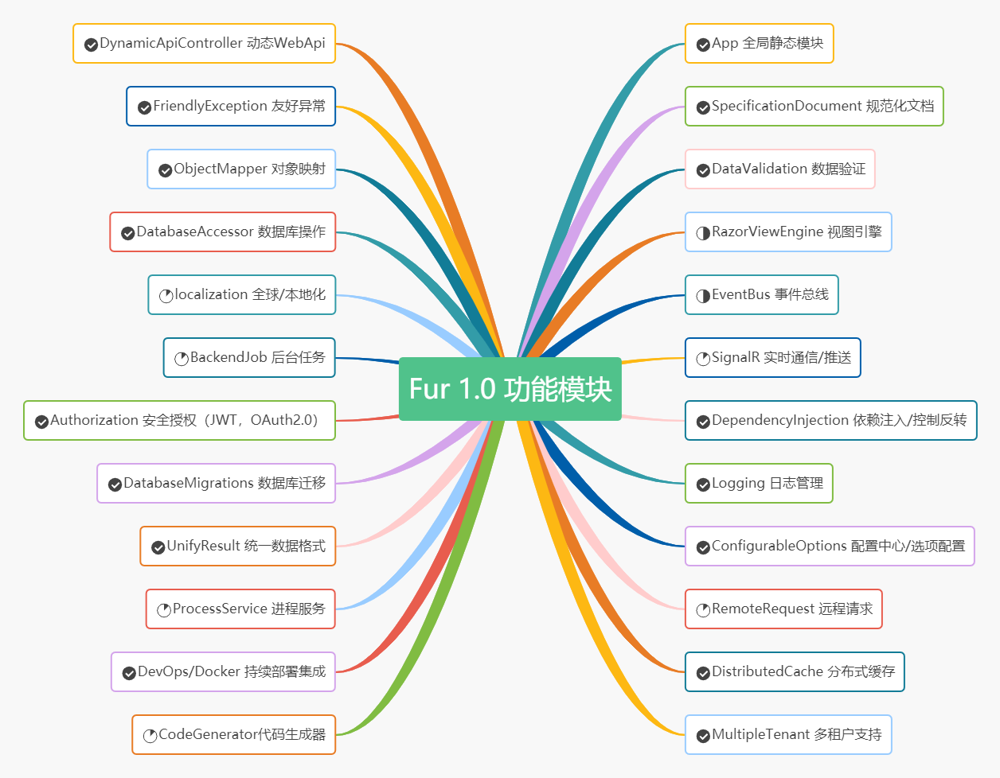

<p></p>
<p></p>

<p align="center">

</p>

<div align="center">

[](https://gitee.com/monksoul/Fur/stargazers) [](https://gitee.com/monksoul/Fur/members) [](https://github.com/MonkSoul/Fur/stargazers) [](https://github.com/MonkSoul/Fur/network) [](https://github.com/MonkSoul/Fur/blob/rc1/LICENSE) [](https://qm.qq.com/cgi-bin/qm/qr?k=PzLMVFTwHlW0Y4HNmLKVKM3BKpzpTHMF&jump_from=webapi)

</div>

<div align="center">

`Fur` 是 `.NET 5` 平台下极易入门、极速开发的 Web 应用框架。

</div>

## ✨ 立即尝鲜 ✨

`Fur` **是基于最新的 .NET 5 RC1 构建，目的是为了尽早体验新功能，对即将到来的 .NET 5 正式版做出最快的响应。** ✈

所以运行 `Fur` 需要以下两个条件：

- **安装最新的 v5.0.0-rc.1**：https://dotnet.microsoft.com/download/dotnet/5.0
- **安装最新的 Visual Studio 2019 Preview**：https://visualstudio.microsoft.com/zh-hans/vs/preview/ 或使用 **Visual Studio Code** 打开 `framework` 目录


<p></p>
<p></p>

**[⏳ 查看 Fur 目前进度](https://gitee.com/monksoul/Fur/board)**

---

## 🍕 名字的由来

> 故事是这样子的：
>
> 起初，想开发一个极易入门、极易维护的框架，开发理念为：`一切从简，只为了更懒`。
>
> 所以自然而然想到了：`Lazier`，也就是 **更懒** 的意思。但是 **更懒** 和 **更烂** 读音相近且中文名没有特色，对此换名问题我苦恼了好几天。
>
> 刚好有一次我在博客园中帮一个博友解答问题，解决后博友赞扬我对 `.NET Core` 颇有了解，我就顺嘴回答了一句：**“略懂皮毛”**。
>
> 就这时，脑瓜子灵机一动，干脆起名为：**“皮毛”**？英文单词 **“`Fur` [fɜː(r)]”**，单词又短而且中文读音既俗气又顺口。😄😎
>
> 所以，**`Fur`** 就诞生了。
>
> 之后就有了 **“小僧不才，略懂皮毛（Fur）。”** 广告语 和 **[furos.cn](https://furos.cn)** 域名。

## 🍔 关于 LOGO

`Fur` LOGO 设计由 `F` `U` `R` 三个单词组成：

<p>

</p>

我相信很多人看到 `Fur` 的 LOGO 时都会问：“为什么选择奶牛？”，因为 **那些年吹过的牛逼都实现了 🐮**。

之所以选择 **奶牛** 是因为 `牛` 具有脚踏实地，任劳任怨的做事风格，同时 **奶牛** 意味着丰富的营养价值，正如 `Fur` 所能带给你的。

## 🍟 文档地址

[https://monksoul.gitee.io/fur/](https://monksoul.gitee.io/fur/) 临时的

## 🌭 开源地址

- Gitee：[https://gitee.com/monksoul/Fur](https://gitee.com/monksoul/Fur)
- GitHub：[https://github.com/monksoul/Fur](https://github.com/monksoul/Fur)
- 博客园：[https://www.cnblogs.com/dotnetchina](https://www.cnblogs.com/dotnetchina)

## 🍿 Docker 镜像

```shell
docker run --name fur -p 5000:80 monksoul/fur:v1.0.0.rc2
```

## 🥞 架构设计

正在整理中...

## 🥝 功能模块

<p align="center">

</p>

## 🥐 框架依赖

`Fur` 为了追求极速入门，极致性能，尽可能的不使用或减少第三方依赖。目前 `Fur` 仅集成了以下三个依赖：

- [Mapster](https://github.com/MapsterMapper/Mapster)：比 `AutoMapper` 还高性能的对象映射
- [MiniProfiler](https://github.com/MiniProfiler/dotnet)：性能分析和监听必备
- [Swashbuckle](https://github.com/domaindrivendev/Swashbuckle.AspNetCore)：`Swagger` 接口文档

麻雀虽小五脏俱全。`Fur` 即使只集成了这三个依赖，但是主流的 `依赖注入/控制反转`，`AOP` 面向切面编程，`事件总线`，`数据验证`，`数据库操作` 等等一个都不少。

## 🥗 环境要求

- Visual Studio 2019 Preview 16.8 +
- .NET 5 SDK +
- .Net Standard 2.1 +

## 🥪 支持平台

- 运行环境
  - Windows
  - Linux
  - MacOS
  - Docker/K8S/K3S/Rancher
- 数据库
  - SqlServer
  - Sqlite
  - Azure Cosmos
  - MySql
  - PostgreSQL
  - InMemory
  - Oracle

## 🍖 关于性能

`Fur` 目前采用 `Visual Studio 2019 Preview 16.8` 自带性能测试和 `JMeter` 进行测试，由于篇幅有限，只贴部分测试图，测试结果如下：


## 🥟 问答 FAQ

🥇 **1. 不是有一个 Abp 框架了吗？**

`Abp` 确实是非常棒的框架，曾经本人也受益于它，`Fur` 并不是想要替代 `Abp`，而是想给 `.NET` 开发者多一个选择。

同时 `Fur` 框架是本人这 12 年的 `.NET` 开发经验的浓缩版。

🥈 **2. 和 Abp 框架的区别？**

`Fur` 和 `Abp` 有几大区别：

- `Fur` 追求的是极少依赖和极速开发，和 `Abp` 大而包容不同
- `Fur` 遵循宽松自由的 `Apache-2.0` 开源协议，这一点和 `Abp` 采用商用 `LGPL-3.0` 协议有着很大差别
- `Fur` 符合中国国情开发，深知中国开发者最需要什么，框架内部提供了大量开发者需要的语法糖，而不仅仅是基础操作
- `Fur` 和 `Abp` 在实现相同功能上，`Fur` 做的更加灵活和简单
- `Fur` 是基于最新的 `.NET 5` 开发，抛开历史包袱，乘上 `.NET` 彻底跨平台的大船
- `Fur` 是作为中国开发者推出，仅此而已

🥉 **3. 为什么想要开发这样的一个框架？**

开发这样的框架目的是为了能够提高自己的开发效率，也是为了验证自己对 `.NET` 新技术的掌握程度，同时也希望通过开源能够帮到更多的 `.NET` 开发者，也能从中受益。

---

## 🍚 关于作者

一个拥有 12 年开发经验 `.NETer`。喜欢分享，喜欢新技术，在互联网多个技术领域皆有涉猎。

## 🍤 项目成员

<a href="https://gitee.com/monksoul" target="_blank" margin="5" style='margin:5px'></a>
<a href="https://gitee.com/dotnetchina" target="_blank"  margin="5" style='margin:5px'></a>
<a href="https://gitee.com/zero530" target="_blank"  margin="5" style='margin:5px'></a>
<a href="https://gitee.com/rgleehom" target="_blank" margin="5" style='margin:5px'></a>
<a href="https://gitee.com/KaneLeung" target="_blank" margin="5" style='margin:5px'></a>
<a href="https://gitee.com/qd98zhq" target="_blank" margin="5" style='margin:5px'></a>
<a href="https://gitee.com/andyliuqiurong" target="_blank" margin="5" style='margin:5px'></a>
<a href="https://gitee.com/co1024" target="_blank" margin="5" style='margin:5px'></a>
<a href="https://gitee.com/LkyQiuFeng" target="_blank" margin="5" style='margin:5px'></a>
<a href="https://gitee.com/yzyk126" target="_blank" margin="5" style='margin:5px'></a>
<a href="https://gitee.com/lindexi" target="_blank" margin="5" style='margin:5px'></a>

<p></p>

🎈 欢迎更多的开发者加入 `Fur` 大家庭。

## 🍝 谁在使用

- 百签科技（广东）有限公司
- 码为科技（广州）有限公司
- 广州启顺国际货运代理有限公司
- 森丰供应链服务（广州）有限公司
- 中山赢友网络科技有限公司
- 中山模思软件科技有限公司
- 珠海市恒泰新软件有限责任公司
- 珠海思诺锐创软件有限公司
- 深圳市易胜科技有限公司
- 重庆虫儿飞科技有限公司
- 重庆林木森科技有限公司

如果您的项目使用到 `Fur` 开发，可以告诉我们。

## 🍻 贡献代码

`Fur` 遵循 `Apache-2.0` 开源协议，欢迎大家提交 `PR` 或 `Issue`。

如果要为项目做出贡献，请查看贡献指南。

## 🍍 捐赠列表

注：排序按捐赠顺序书写

| 捐赠人昵称      | 捐赠金额（元） | 附语               |
| --------------- | -------------- | ------------------ |
| 🤴 爱吃油麦菜   | **100**        | 感谢您的开源项目！ |
| 👳‍♂️ 麦壳饼       | **200**        | 感谢您的开源项目！ |
| 👨 Sun          | **100**        | 感谢您的开源项目！ |
| 👶 d617617      | **20**         | 感谢您的开源项目！ |
| 👦 Diqiguoji008 | **16.66**      | 见贤思齐           |
| 👲 nodyang      | **100**        | 感谢您的开源项目！ |
| 👳‍♀️ mictxd       | **100**        | 吹过的牛都实现。   |

非常感谢您们的支持，正是因为您们，中国开源才可以越走越远，`Fur` 越走越远。

## 🧆 友情链接

👉 **[Fur](https://gitee.com/monksoul/Fur)** 👉 **[SqlSugar](https://github.com/sunkaixuan/SqlSugar)** 👉 **[Layx](https://gitee.com/monksoul/LayX)**
