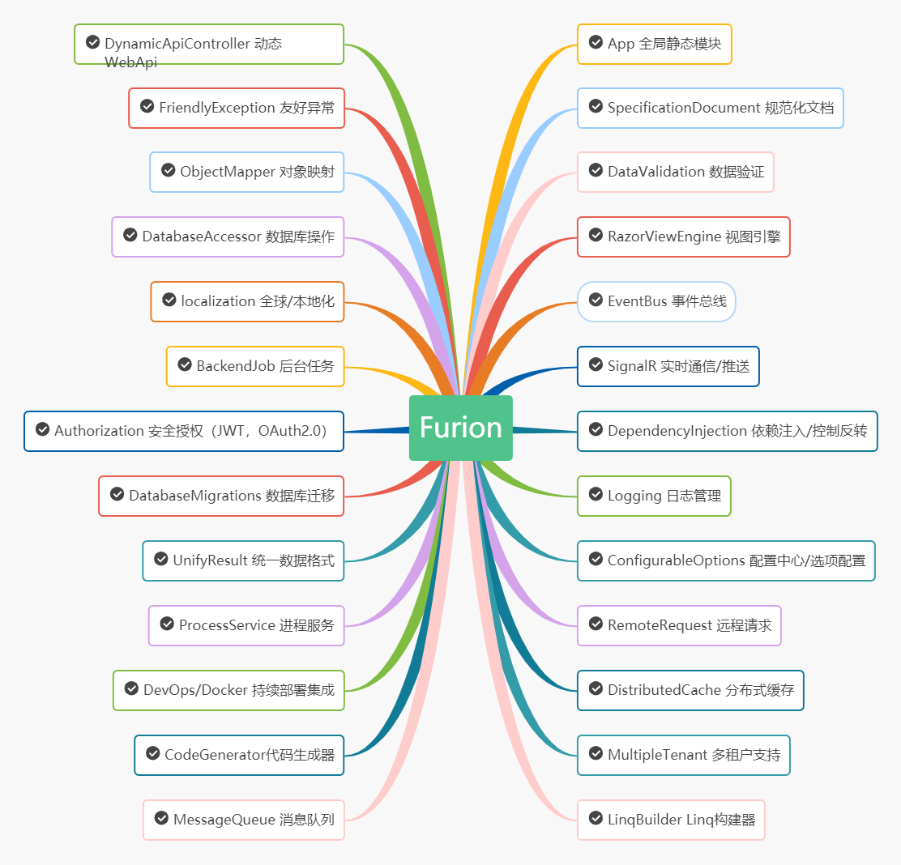

<p></p>
<p></p>

<p align="center">

</p>

<div align="center">

[](https://gitee.com/dotnetchina/Furion/stargazers) [](https://gitee.com/dotnetchina/Furion/members) [](https://github.com/MonkSoul/Furion/stargazers) [](https://github.com/MonkSoul/Furion/network) [](https://gitee.com/dotnetchina/Furion/blob/master/LICENSE) [](https://www.nuget.org/packages/Furion)

</div>

<div align="center">

让 .NET 开发更简单，更通用，更流行。

</div>

<div align="center">

**简体中文 | [English](./README.md)**

</div>

## 💐 序言

> 无私奉献不是天方夜谭，有时候，我们也可以做到。

## 🍕 名字的由来

> 故事是这样子的：
>
> 自微软宣布 `.NET 5` 平台消息之后，就琢磨着开发一个基于 `.NET 5` 平台的开发框架，想做第一个吃 `.NET 5` 螃蟹尝鲜之人。
>
> 一开始想到了 `Lazier` 作为框架的名称，中文有 **更懒** 的意思。符合我的 “一切从简，只为了更懒” 的开发理念。
>
> 但是 **更懒** 和 **更烂** 中文读音相近且没有特色，而且寓意也不是很好，对此换名问题苦恼了好些天。
>
> 刚好有一次在 QQ 群中无意间刷到了群友发的 **“先知”** 单词：**“`Furion`”**，就那一刻，就认定它了！
>
> `Furion` 中文有 `先知` 的意思，恰好符合我创造框架的初衷。所以，**`Furion`** 就诞生了。

## 🍔 关于 LOGO

`Furion` 标志设计理念是借鉴著名的 [袋鼠理论](https://baike.baidu.com/item/%E8%A2%8B%E9%BC%A0%E7%90%86%E8%AE%BA) 设计的。

袋鼠具有**长腿、育袋、自我奔跑**特点。

- `长腿`：代表着 `Furion` 拥有稳健的双腿，走在科技的前沿，走的更远，跑的更快。
- `育袋`：小育袋、大作为。期待 `Furion` 能够育孕出更多 .NET 优秀开发者和生机勃勃的生态。
- `自我奔跑`：`Furion` 自身也要不断学习、不断进步、不断创新、不断开拓。

<p>

</p>

## 🍟 文档地址

- 国内文档：[https://dotnetchina.gitee.io/furion](https://dotnetchina.gitee.io/furion)
- 国外文档：[https://furion.pro](https://furion.pro)

**目前文档正在逐步完善中。**

## 🍯 开源案例

- **[Admin.NET](https://gitee.com/zuohuaijun/Admin.NET)**：基于 `Furion` 的通用权限管理平台。
- **[考试君](https://gitee.com/pig0224/ExamKing)**：基于 `Furion` 的在线考试系统
- **[园丁](https://gitee.com/hgflydream/Gardener)**：基于 `Furion` + `Blazor` 的超简单后台管理系统
- **[Queer](https://gitee.com/songzhidan/queer)**：基于 `Furion` + `Layui` 的通用型管理系统
- **[Pear Admin](https://gitee.com/pear-admin/pear-admin-furion)**：基于 `Furion` + `PearAdmin` 管理系统
- **[JoyAdmin](https://gitee.com/a106_admin/joy-admin)**：基于 `Furion` + `iviewadmin` 开发的管理系统
- **[YShop](https://gitee.com/yell-run/yshop)**：基于 `Furion` + `Vue` 开发的移动电商项目

## 🥦 系列教程

- **Furion 视频教程：[https://space.bilibili.com/695987967](https://space.bilibili.com/695987967)**
- Furion 使用例子：[https://gitee.com/monksoul/furion-samples](https://gitee.com/monksoul/furion-samples) **可能大部分示例已经不通用**
- Furion 系列教程：[《学 .NET 5 从 Furion 开始》](https://gitee.com/dotnetchina/Furion/blob/main/tutorials) 系列

## 🌭 开源地址

- Gitee：[https://gitee.com/dotnetchina/Furion](https://gitee.com/dotnetchina/Furion)
- GitHub：[https://github.com/monksoul/Furion](https://github.com/monksoul/Furion)
- Docker：[https://hub.docker.com/r/monksoul/furion](https://hub.docker.com/r/monksoul/furion)
- Nuget：[https://www.nuget.org/packages/Furion](https://www.nuget.org/packages/Furion)

## 🍿 Docker 镜像

- `Docker Hub` 线上镜像

```shell
docker run --name furion -p 5000:80 monksoul/furion:v2.8.3
```

- `手动` 打包镜像

打开 `CMD/Shell/PowerShell` 进入 `Furion` 项目根目录打包 `Furion` 镜像：

```shell
docker build -t furion:v2.8.3 .
```

打包成功后，直接 `docker run`：

```shell
docker run --name furion -p 5000:80 furion:v2.8.3
```

## 🥥 框架拓展包

|                                                                     包类型                                                                      | 名称                                       |                                                                                          版本                                                                                           | 描述                       |
| :---------------------------------------------------------------------------------------------------------------------------------------------: | ------------------------------------------ | :-------------------------------------------------------------------------------------------------------------------------------------------------------------------------------------: | -------------------------- |
|                   [](https://www.nuget.org/packages/Furion)                   | Furion                                     |                                     [](https://www.nuget.org/packages/Furion)                                     | Furion 核心包              |
|   [](https://www.nuget.org/packages/Furion.Extras.Authentication.JwtBearer)   | Furion.Extras.Authentication.JwtBearer     |     [](https://www.nuget.org/packages/Furion.Extras.Authentication.JwtBearer)     | Furion Jwt 拓展包          |
| [](https://www.nuget.org/packages/Furion.Extras.DependencyModel.CodeAnalysis) | Furion.Extras.DependencyModel.CodeAnalysis | [](https://www.nuget.org/packages/Furion.Extras.DependencyModel.CodeAnalysis) | Furion CodeAnalysis 拓展包 |
|       [](https://www.nuget.org/packages/Furion.Extras.Web.HttpContext)        | Furion.Extras.Web.HttpContext              |              [](https://www.nuget.org/packages/Furion.Extras.Web.HttpContext)              | Furion HttpContext 拓展包  |
|     [](https://www.nuget.org/packages/Furion.Extras.ObjectMapper.Mapster)     | Furion.Extras.ObjectMapper.Mapster         |         [](https://www.nuget.org/packages/Furion.Extras.ObjectMapper.Mapster)         | Furion Mapster 拓展包      |
|  [](https://www.nuget.org/packages/Furion.Extras.DatabaseAccessor.SqlSugar)   | Furion.Extras.DatabaseAccessor.SqlSugar    |    [](https://www.nuget.org/packages/Furion.Extras.DatabaseAccessor.SqlSugar)    | Furion SqlSugar 拓展包     |
|   [](https://www.nuget.org/packages/Furion.Extras.DatabaseAccessor.Dapper)    | Furion.Extras.DatabaseAccessor.Dapper      |      [](https://www.nuget.org/packages/Furion.Extras.DatabaseAccessor.Dapper)      | Furion Dapper 拓展包       |
|   [](https://www.nuget.org/packages/Furion.Extras.DatabaseAccessor.MongoDB)   | Furion.Extras.DatabaseAccessor.MongoDB     |     [](https://www.nuget.org/packages/Furion.Extras.DatabaseAccessor.MongoDB)     | Furion MongoDB 拓展包      |
|       [](https://www.nuget.org/packages/Furion.Extras.Logging.Serilog)        | Furion.Extras.Logging.Serilog              |              [](https://www.nuget.org/packages/Furion.Extras.Logging.Serilog)              | Furion Serilog 拓展包      |

## 🍄 框架脚手架

|                                                                 模板类型                                                                 | 名称                             |                                                                                 版本                                                                                 | 描述                   |
| :--------------------------------------------------------------------------------------------------------------------------------------: | -------------------------------- | :------------------------------------------------------------------------------------------------------------------------------------------------------------------: | ---------------------- |
|       [](https://www.nuget.org/packages/Furion.Template.Mvc/)        | Furion.Template.Mvc              |              [](https://www.nuget.org/packages/Furion.Template.Mvc/)              | Mvc 模板               |
|       [](https://www.nuget.org/packages/Furion.Template.Api/)        | Furion.Template.Api              |              [](https://www.nuget.org/packages/Furion.Template.Api/)              | WebApi 模板            |
|       [](https://www.nuget.org/packages/Furion.Template.App/)        | Furion.Template.App              |              [](https://www.nuget.org/packages/Furion.Template.App/)              | Mvc/WebApi 模板        |
|      [](https://www.nuget.org/packages/Furion.Template.Razor/)       | Furion.Template.Razor            |            [](https://www.nuget.org/packages/Furion.Template.Razor/)            | RazorPages 模板        |
| [](https://www.nuget.org/packages/Furion.Template.RazorWithWebApi/)  | Furion.Template.RazorWithWebApi  |  [](https://www.nuget.org/packages/Furion.Template.RazorWithWebApi/)  | RazorPages/WebApi 模板 |
|      [](https://www.nuget.org/packages/Furion.Template.Blazor/)      | Furion.Template.Blazor           |           [](https://www.nuget.org/packages/Furion.Template.Blazor/)           | Blazor 模板            |
| [](https://www.nuget.org/packages/Furion.Template.BlazorWithWebApi/) | Furion.Template.BlazorWithWebApi | [](https://www.nuget.org/packages/Furion.Template.BlazorWithWebApi/) | Blazor/WebApi 模板     |

**[如何使用脚手架](https://dotnetchina.gitee.io/furion/docs/template)**

## 🍎 框架特点

- 全新面貌：基于 `.NET5/6` 平台，没有历史包袱
- 极易入门：只需要一个 `Inject()` 即可完成配置
- 极速开发：内置丰富的企业应用开发功能
- 极少依赖：框架只依赖两个第三方包
- 极其灵活：轻松面对多变复杂的需求
- 极易维护：采用独特的架构思想，只为长久维护设计
- 完整文档：提供完善的开发文档

## 🥞 架构设计

正在整理中...

## 🥝 功能模块

<p align="center">

</p>

## 🥐 框架依赖

`Furion` 为了追求极速入门，极致性能，尽可能的不使用或减少第三方依赖。目前 `Furion` 仅集成了以下两个依赖：

- [MiniProfiler](https://github.com/MiniProfiler/dotnet)：性能分析和监听必备
- [Swashbuckle](https://github.com/domaindrivendev/Swashbuckle.AspNetCore)：`Swagger` 接口文档

麻雀虽小五脏俱全。`Furion` 即使只集成了这两个依赖，但是主流的 `依赖注入/控制反转`，`AOP` 面向切面编程，`事件总线`，`数据验证`，`数据库操作` 等等一个都不少。

## 🥗 环境要求

- Visual Studio 2019 16.8 +
- .NET 5 SDK +
- .Net Standard 2.1 +

## 🥪 支持平台

- 运行环境
  - Windows
  - Linux
  - MacOS
  - Docker/K8S/K3S/Rancher
  - Xamarin/MAUI
- 数据库
  - SqlServer
  - Sqlite
  - Azure Cosmos
  - MySql
  - MariaDB
  - PostgreSQL
  - InMemoryDatabase
  - Oracle
  - Firebird
  - 达梦数据库
  - MongoDB
- 应用部署
  - Kestrel
  - Nginx
  - Jexus
  - IIS
  - Apache
  - PM2
  - Supervisor
  - 独立发布/单文件
  - 容器（Docker/K8S/K3S/Rancher）

## 🍖 关于性能

`Furion` 目前采用 `Visual Studio 2019 16.8` 自带性能测试和 `JMeter` 进行测试，由于篇幅有限，只贴部分测试图，测试结果如下：


## 🌴 Stars 趋势图

[](https://whnb.wang/dotnetchina/Furion?e=43200)

## 🍻 贡献代码

`Furion` 遵循 `Apache-2.0` 开源协议，欢迎大家提交 `PR` 或 `Issue`。

如果要为项目做出贡献，请查看 [贡献指南](https://dotnetchina.gitee.io/furion/docs/contribute)。

感谢每一位为 `Furion` 贡献代码的朋友。

[](https://giteye.net/chart/ZS49EPL6)

**特别鸣谢 [TLog 作者](https://gitee.com/bryan31) 提供的贡献者实时头像。**
