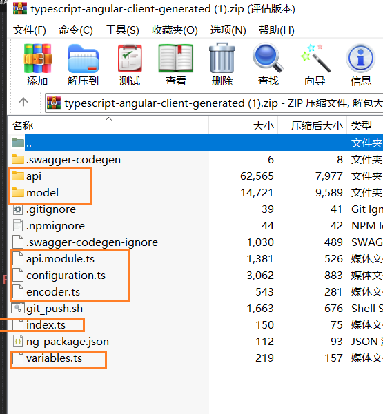

### 使用手册

1. 在源码目录下（`src`）创建 `api-services` 文件夹，并将 [https://editor.swagger.io](https://editor.swagger.io) 生成的 `typescript-angular` 代码（`.ts` 后缀文件）放入其中。



2. 拷贝 `Furion` 源码下的 `clients/angular/angular-utils.ts`文件放置到 `api-services` 同级目录下，同时修改 `serveConfig` 中的配置地址为对应的服务器地址。

3. 注册 `ServeModule` 模块

在 `src/app/app.module.ts` 注册 `ServeModule`，如：

```ts
import { ServeModule } from "src/angular-utils";

@NgModule({
  declarations: [AppComponent],
  imports: [BrowserModule, AppRoutingModule, ServeModule], // 这里注册 ServeModule
  providers: [],
  bootstrap: [AppComponent],
})
export class AppModule {}
```

4. 基本使用

在组件的 `constructor` 中依赖注入特定的服务即可，比如 `PersonService`：

```ts
import { Component } from "@angular/core";
import { PersonService } from "src/api-services";

@Component({
  selector: "app-root",
  templateUrl: "./app.component.html",
  styleUrls: ["./app.component.css"],
})
export class AppComponent {
  title = "angulars";

  // 注入 PersonService
  constructor(private personService: PersonService) {}

  ngOnInit(): void {
    // 使用 personService
    this.personService.apiPersonAllGet().subscribe({
      next: (res) => {
        // 请求成功
        console.log(res);
      },
      error: (err) => {
        // 请求失败
      },
      complete: () => {
        // 请求完成
      },
    });
  }
}
```

---

如果服务器有 API 发生改变，重新生成代码并替换 `api-services` 目录所有代码即可（**建议先删除里面所有文件后再粘贴**）

### 常见问题

可能个别的 `Angular` 版本会出现 `api-services/encoder.ts` 文件问题，这时候只需要在 `encodeKey` 和 `encodeValue` 前面添加 `override` 即可。

```ts
export class CustomHttpUrlEncodingCodec extends HttpUrlEncodingCodec {
  override encodeKey(k: string): string {
    k = super.encodeKey(k);
    return k.replace(/\+/gi, "%2B");
  }
  override encodeValue(v: string): string {
    v = super.encodeValue(v);
    return v.replace(/\+/gi, "%2B");
  }
}
```

`Swagger` 多分组处理

如果使用了`Swagger` 多分组的功能，可以升级 `Furion` 框架至 `v3.3.4` 版本，之后启用 `EnableAllGroups` 功能，如：

```json
{
  "SpecificationDocumentSettings": {
    "EnableAllGroups": true
  }
}
```

这样就会自动将所有分组的内容合并到 `All Groups` 中。
